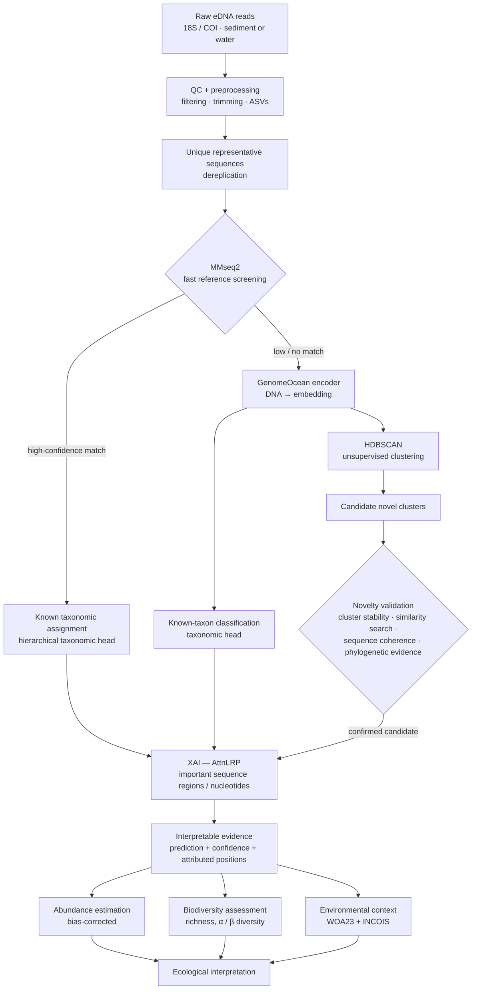
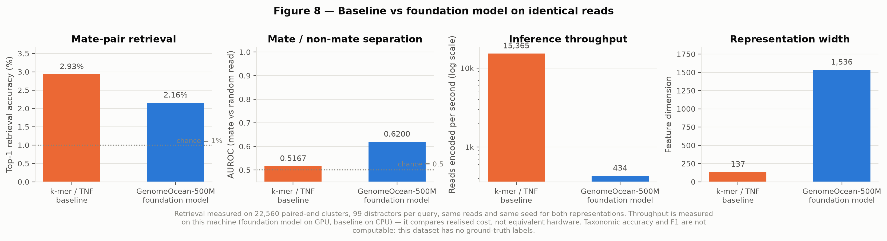
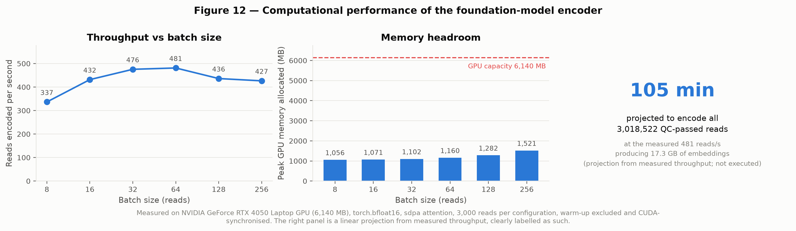
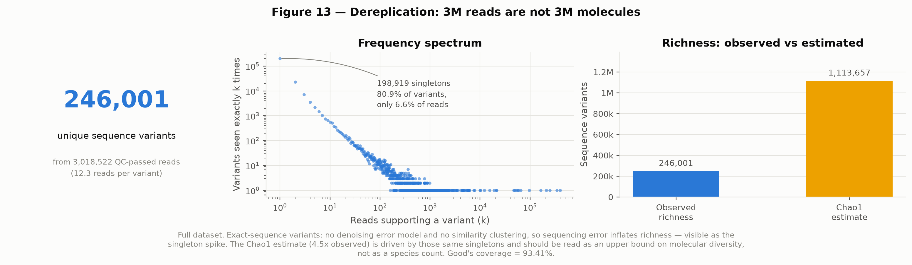
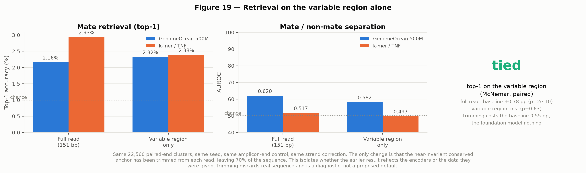
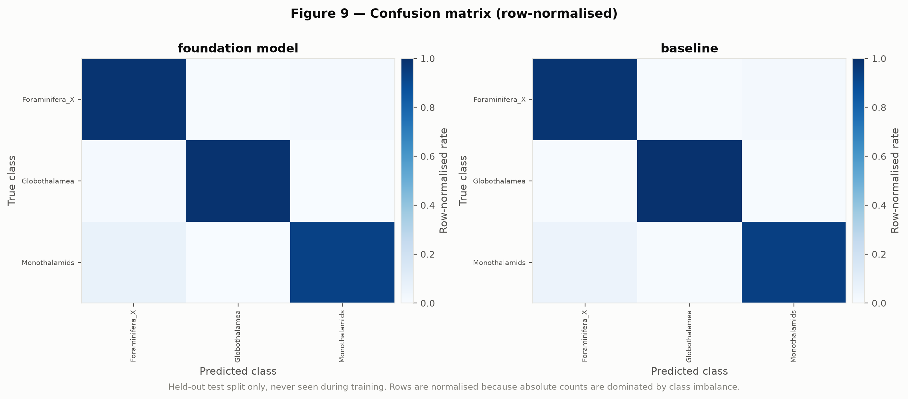
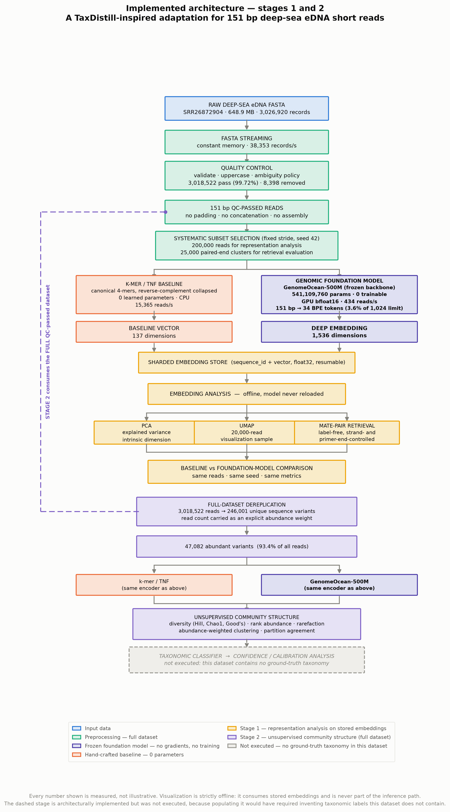

# Deep-sea eDNA — genomic foundation model representation pipeline

A four-stage pipeline that takes raw deep-sea environmental DNA short reads,
encodes them with a genomic foundation model, and evaluates whether the
resulting embeddings support downstream taxonomic analysis.

**A TaxDistill-inspired adaptation for short deep-sea eDNA reads** — not a
reproduction. The paper ([arXiv:2605.28868](https://arxiv.org/abs/2605.28868))
works on assembled contigs ≥ 2,000 bp; this dataset is 151 bp raw reads, and the
differences are documented rather than glossed over. See
[`docs/METHODOLOGY.md`](docs/METHODOLOGY.md).

---

## The research question

> Can raw deep-sea eDNA short reads be processed through a genomic
> foundation-model pipeline to obtain useful genomic embeddings that support
> downstream taxonomic analysis?

**Answer: yes, technically — but the binding constraint turned out to be
reference database coverage, not the encoder.**

## Headline findings

| | |
|---|---|
| Dataset | 3,026,920 reads · 151 bp · 648.9 MB · 1,513,460 paired-end clusters |
| **Identified as** | **deep-sea benthic Foraminifera 18S rRNA metabarcoding (s14F1/s15, 37F region)** |
| Encoder | `pGenomeOcean/GenomeOcean-500M` — the paper's actual model, 541 M params, 0 trainable |
| Compatibility | 151 bp → ~34 BPE tokens = 3.6% of the model's limit; 0 `[UNK]`, 0 truncation, **0 padding** |
| Throughput | 476 reads/s on a 6 GB laptop GPU, peak 1.2 GB VRAM |
| Unique variants | 246,001 from 3M reads — **7 variants are 50% of the library** |
| Taxonomic labels | reference-derived, **only 5.2% assignable at genus level** |
| Classification | 97–98% accuracy at class/order on both representations |
| Distillation | **no significant benefit** — task saturated at 99% |

Four reports in [`outputs/reports/`](outputs/reports/) carry every number.

---

## Target architecture

The four-stage pipeline in this repository answers the *research question* —
it's what was actually built and measured. It also produced the finding that
shapes everything below: **the binding constraint is reference-database
coverage, not the encoder.** Only 5.2% of variants are assignable at genus
level; most of the community sits in a resolution gap that's too divergent
for confident reference matching but isn't evidence of "no organism there."

The architecture below is the target design for a full open-world eDNA
pipeline built around that finding: screen cheaply against references
first, spend foundation-model compute only on what references can't
resolve, and treat "no reference match" as a discovery signal to cluster
and validate rather than a dead end. **This is a design document, not a
claim about what exists in this repository** — see the status note below
the diagram for implemented vs. planned.



### Why each stage exists

| Stage | Problem it solves |
|---|---|
| QC + ASV/representative-sequence collapse | Computational — don't send millions of redundant reads into a foundation model. |
| MMseq2 | Computational + known-taxon — use the cheap conventional method first; a foundation model shouldn't spend compute on a sequence that already has a strong reference match. |
| GenomeOcean encoder | Poor reference-database coverage — for sequences without a convincing match, obtain a learned representation instead of declaring them "unclassified" outright. |
| HDBSCAN | Genuinely unsupervised discovery — candidate novel groups from embeddings, no predefined species label required. |
| Novelty validation | Prevents garbage clusters. A cluster isn't "novel" just because HDBSCAN drew a boundary around it — needs stability, expanded similarity search, sequence coherence, and phylogenetic evidence where feasible. |
| AttnLRP | Mandatory XAI, not an optional visualization — every prediction ships with the sequence positions that drove it. |
| Environment (WOA23 + INCOIS) | Deliberately kept **out of** the taxonomy/novelty branch, applied only after classification. "Where does this lineage occur, at what depth, under what conditions" is defensible; "DNA + ocean conditions → taxon" as the primary classifier is not. |

### Tech stack

| Layer | Tools |
|---|---|
| Sequencing | Illumina · FASTQ |
| Bioinformatics | DADA2 · VSEARCH |
| Search | MMseq2 |
| Deep learning | PyTorch · ONNX |
| Clustering | HDBSCAN · Leiden |
| XAI | AttnLRP |
| Database | PostgreSQL · pgvector |
| API / frontend | FastAPI · React · TypeScript |
| Pipeline orchestration | Snakemake · Docker |

### Problem-to-architecture mapping

| PS problem | Architecture component |
|---|---|
| Poor reference databases | GenomeOcean representation |
| Unassigned / divergent sequences | Foundation-model branch |
| Novel taxa | HDBSCAN |
| Need classification | MMseq2 + taxonomic classifier |
| Need annotation | Taxonomic output |
| Need abundance | Read/ASV abundance aggregation |
| Need biodiversity | Richness + α/β diversity |
| Computational time | Deduplication + MMseq2 early filtering |
| Explainability | AttnLRP |
| Verify novel discoveries | Cluster stability + similarity + phylogenetic evidence |
| Deep-sea ecological insight | WOA23 + INCOIS |

The intended research contribution is therefore not a new neural
architecture. It's an efficient open-world eDNA analysis pipeline that uses
conventional methods for the easy cases and learned representations +
unsupervised discovery for the poorly-represented ones, while producing
interpretable sequence evidence for every prediction.

**Status — implemented vs. planned.** What this repository currently
implements and empirically validates (the [Results](#results) section
below) is a simplified left half of this diagram: QC/dereplication, the
GenomeOcean encoder, a k-mer baseline for comparison, and reference-derived
taxonomic assignment — plus a TaxDistill-style distillation experiment that
sits outside the target design entirely. **MMseq2 triage, HDBSCAN novelty
discovery + validation, AttnLRP, the abundance/biodiversity/environmental-
context modules, and the database/API/pipeline layers are not yet
implemented.** This section documents the design they're headed toward, not
a retroactive description of existing code.

---

## Quick start

```bash
pip install -r requirements.txt
python main.py all
```

Expensive stages reuse existing outputs; add `--force` to genuinely recompute.
Any config value can be overridden without editing files:

```bash
python main.py distill --set distillation.alpha=0.3 --set distillation.temperature=3
```

Run a single stage (24 available, `python main.py --help` lists them):

```bash
python main.py preprocess    # full-dataset streaming QC + metrics
python main.py encode        # foundation-model embeddings
python main.py dereplicate   # variants + diversity
python main.py assign        # reference + noisy taxonomic labels
python main.py distill       # TaxDistill teacher/student KD
```

### Requirements

- Python 3.13, ~8 GB RAM, ~5 GB disk for intermediate artefacts
- CUDA GPU recommended (CPU fallback works but foundation-model encoding is far slower)
- ~250 MB of downloads on first run: GenomeOcean (HuggingFace) + PR2/SILVA references

---

## Results

### Stage 1 — representation

GenomeOcean-500M accepts 151 bp reads directly. 200,000 reads encoded with 0
failures and 0 dead dimensions.

With no taxonomy available, representations were compared on **paired-end mate
retrieval**: given one mate's embedding, find its partner among 99 distractors
(1% chance).

| Metric | k-mer / TNF baseline | GenomeOcean-500M |
|---|---|---|
| Top-1 retrieval | **2.93%** | 2.16% |
| AUROC (mate vs random) | 0.5167 | **0.6200** |
| Throughput | **15,365 reads/s** (CPU) | 434 reads/s (GPU) |



Two confounds were found and controlled for: the data is **amplicon, not
shotgun** (uncontrolled, both scores fall *below* chance), and GenomeOcean is
**not reverse-complement invariant** (correcting mate orientation nearly doubled
its top-1). The baseline is provably RC-invariant, verified bit-for-bit.



### Stage 2 — unsupervised community structure

3,018,522 reads dereplicate to **246,001 unique variants**. The community is
extraordinarily uneven: **7 variants carry half the library**, one carries
13.17%. 80.9% of variants are singletons but only 6.6% of reads — the rare tail
is mostly sequencing error, which is why Chao1 (4.5× observed) is reported as an
upper bound, not a species count.



**Only 39.7% of each read varies across the community.** Amplicon end 0 opens
with a 90 bp block that is 97.2% invariant. Positions that don't vary can't
discriminate organisms, so this bounds what *any* representation can achieve.

Trimming that anchor reverses the stage-1 comparison. Top-1 differences are
paired, so tested with McNemar's exact test:

| Comparison | Difference | p | Verdict |
|---|---|---|---|
| Full read: foundation vs baseline | −0.78 pp | 2e−10 | baseline genuinely better |
| Variable region: foundation vs baseline | −0.06 pp | 0.63 | **statistically tied** |
| Baseline: variable vs full read | −0.55 pp | 9e−09 | **loses the anchor's help** |
| Foundation: variable vs full read | +0.16 pp | 0.09 | unaffected |

On the informative region GenomeOcean holds AUROC 0.582 while the baseline falls
to 0.497 — chance.



### Stage 3 — dataset identified, supervised classification

Three independent lines of evidence identify the library:

1. Our conserved anchor matches **66 of 510,495** SILVA SSU sequences — all
   Eukaryota, overwhelmingly Foraminifera
2. The anchor `AAGGGCACCACAAGAACGC` is **s14F1**, a published Foraminifera-specific
   primer for the **37F region of 18S rRNA**
3. All **1,547** PR2 sequences carrying that primer are Foraminifera

Reference choice was measured, not assumed — SILVA was downloaded and **rejected
on evidence** (69 Foraminifera in half a million sequences); PR2 has 1,547.

Labels come from an RDP-style naive Bayes k-mer classifier, cross-validated
*before* use: 94.4% at class, 84.1% at order. **Assignment falls off steeply with
depth** — 58.5% of variants labelled at class, 37.4% at order, **5.2% at genus**.

| Rank | | Accuracy | Macro F1 | ECE |
|---|---|---|---|---|
| class (3, n=9,109) | GenomeOcean | 0.9751 | **0.9679** | 0.021 |
| | k-mer / TNF | 0.9737 | 0.9652 | 0.036 |
| order (5, n=5,773) | GenomeOcean | **0.9792** | **0.8970** | 0.024 |
| | k-mer / TNF | 0.9664 | 0.8311 | 0.041 |

Neither accuracy difference is significant (McNemar p=0.885, p=0.061). The
foundation model leads on macro F1 — the baseline misassigns *Globothalamea_X* to
*Robertinida*, which GenomeOcean resolves.



### Stage 4 — TaxDistill's distillation loop

Three branches, same split, same seed, identical student initialisation:

| Rank | Teacher | Student + KD | Student alone | KD effect |
|---|---|---|---|---|
| class (3) | 0.9876 | 0.9912 | 0.9905 | +0.07 pp, p=1.000 |
| order (5) | 0.9907 | 0.9907 | 0.9896 | +0.11 pp, p=1.000 |

**No significant KD benefit.** The α/T ablation confirms it isn't a
hyperparameter artefact — KD peaks near α≈0.2–0.3 then degrades above 0.4.
Sanity check: **at α=0 the KD student reproduces student-alone exactly**.

**Why:** the task is saturated. All branches sit at 98.8–99.1%; a 138-d k-mer MLP
already solves 3–5 coarse classes almost perfectly, leaving no headroom.

**This does not refute TaxDistill** — the paper evaluates species-level
annotation where the student has real headroom. This dataset cannot test the
claim in the regime where it is interesting, because reference coverage caps us
at class/order.

---

## Project structure



```
main.py                  24-stage CLI; every stage reusable and resumable
configs/default.json     every threshold, size, seed and hyperparameter

preprocessing/           streaming FASTA parser, QC, statistics
models/                  encoder interface, GenomeOcean, k-mer baseline, classifier
embeddings/              sharded storage with checkpoint/resume, batch inference
analysis/                PCA, UMAP, dereplication, diversity, community, amplicon
evaluation/              retrieval benchmarks, comparison, performance
taxonomy/                reference building, naive Bayes classifier, assignment
training/                TaxDistill knowledge distillation
visualization/           all figures + architecture diagram
reporting/               the four reports
tests/                   61 tests
docs/METHODOLOGY.md      paper-vs-adaptation, labelled component by component
```

**Swapping the encoder** is a one-class change: implement `SequenceEncoder`
(`models/encoder.py`) and register it. Preprocessing, storage, analysis and
reporting are untouched.

---

## Data availability

Large artefacts are **not** in this repository:

| Not committed | Size | How to obtain |
|---|---|---|
| `SRR26872904.fasta/` | 649 MB | NCBI SRA accession `SRR26872904` |
| `data/reference/` | 245 MB | auto-downloaded by `python main.py assign` (PR2 5.0.0, SILVA 138.2) |
| `outputs/embeddings/` | 2.6 GB | regenerated by `python main.py encode baseline` |

Committed: all source, configs, tests, docs, **33 figures**, **41 metrics files**
and **4 reports** — so every result is inspectable without re-running anything.

---

## Tests

```bash
python -m pytest tests/ -q     # 61 tests, ~9 s
```

Hand-implemented quantities are each validated against an **independent** source:

| Implementation | Validated against |
|---|---|
| Hurlbert rarefaction | brute-force Monte Carlo subsampling |
| Rank-based AUROC | `sklearn.metrics.roc_auc_score` |
| Shannon entropy | `scipy.stats.entropy` |
| Chao1, Good's coverage, Hill numbers | closed-form values computed by hand |
| Classification metrics | `sklearn` accuracy / macro-F1 / weighted-F1 |
| Expected calibration error | synthetic calibrated & overconfident predictors |
| Streaming digest dereplication | a naive `Counter` over full sequences |
| Canonical k-mer vectors | RC-invariance, plus a non-canonical control |

---

## Scientific integrity

Things this project deliberately does **not** do:

- **No padding.** Reads are never padded toward the paper's 2,000 bp threshold.
- **No `≥2,000 bp` filter.** It would discard 100% of the reads.
- **No invented labels.** Stages 1–2 report supervised metrics as unavailable
  because no taxonomy existed; stage 3 labels are reference-derived and
  everywhere marked **noisy, not ground truth**.
- **No fabricated compatibility.** GenomeOcean's ability to take 151 bp reads is
  measured before bulk inference and raises if it fails.
- **No winner declared on noise.** Paired McNemar tests throughout.
- **No claim of reproducing TaxDistill.**

Anything not measurable is reported verbatim as *"Not available with the current
dataset/experimental setup."*

Two errors found in my own setup and corrected, both documented in the reports:
feature standardisation (without it the baseline collapsed to majority-class and
produced a spurious 3.5× macro-F1 gap), and teacher head capacity (a linear
teacher vs an MLP student made "KD doesn't help" an artefact).

## Limitations

1. Labels are reference-derived, not ground truth (5.6% / 15.9% measured CV error).
2. Only 5.2% of variants assignable at genus — conclusions apply to a biased subset.
3. Coarse ranks only (3 and 5 classes) vs the paper's species level.
4. Partly circular evaluation: labels come from a k-mer model, one representation is k-mer based.
5. Single sample, single site, single sequencing run — no abundance across environments.
6. Foundation-model inference on subsets, not all 3M reads (full cost reported as a measured projection).
7. Deep hierarchical loss not implemented.

## Reproducibility

Fixed seed (42) across Python/NumPy/Torch, cuDNN deterministic, all settings in
`configs/default.json`, no machine-specific paths, per-stage entry points,
resumable embedding extraction, and the full environment recorded in every
metrics file. Re-running the full pipeline reproduces every reported number
exactly (verified).
